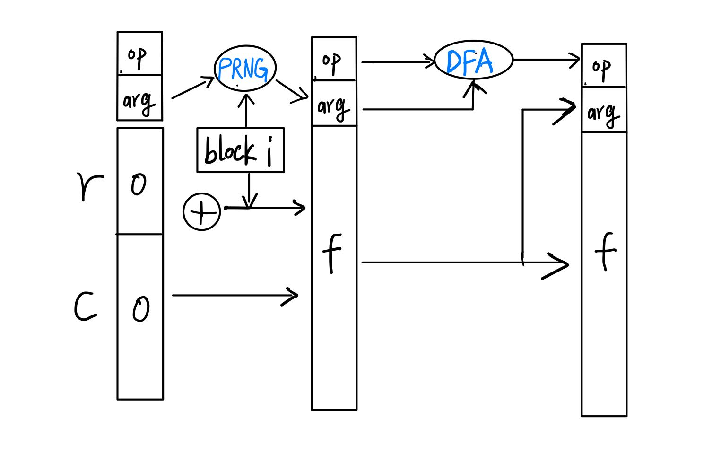
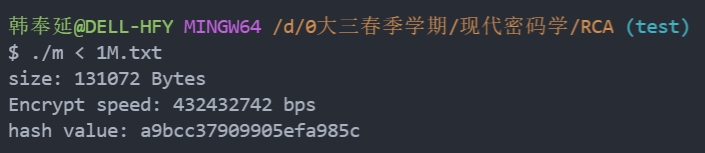

[toc]

## RCA: Hash 函数算法设计报告

要求：输入任意长度消息，输出80 bits的 hash值

#### 一、算法命名

RCA: Random cell automata for hash algorithm.

我们从算法设计组成来为算法命名。通过查阅相关hash函数设计文献（附录）和设计算法框架的迭代，我们确定了设计基于Sponge结构的安全hash函数。其中RCA算法的两大设计组成是，伪随机序列生成器和每轮迭代函数加密自动机的设计。因此我们将这两个我们算法最大的特点融合在一起，给算法一个简单明了的命名——**RCA**!

#### 二、设计理念

**满足三大安全特性，同时具备创新性、灵活性、轻量级**

理想hash 函数应该具备随机函数的特性，而构造真正的随机序列仍是计算机学术界的一大难题。但是伪随机序列在密码学中仍有着非常广泛的运用。在hash 函数的设计中，如2021年Ripon Patgiri等人提出的OSHA算法将伪随机序列的构造当作hash函数组成的关键部分，而其使用的迭代结构更类似于MD5。 我们也考虑利用伪随机序列的特性，并尝试将其也应用到比MD5的出现更新的Sponge结构中。

同时我们认真考虑了安全hash函数的三大特性：

- 无碰撞性（Collision-resistance)  找到不同消息（$M_1,M_2$)有相同的指纹是计算不可行的

- 抗原像攻击（preimage resistance）给定任意消息指纹$Y=H(M)$，恢复消息$M$是计算不可行的

- 抗第二原像攻击（Second-preimage resistance）给定任意消息$M_1$,找到另一个消息$M_2$具有相同的电子指纹

  $H（M_1）=H(M_2)$是计算不可行的。

对于无碰撞性，我们调研到基于Cellular Automata的hash 函数的设计是 collision-free 的，也就是具备无碰撞性，我们认识到本质上是一种自动机的设计规则，同时基于CA和Sponge的hash函数已经有CASH系列存在，而且被证明具备以上的三大特性。主要是增强了Sponge结构内部函数的混淆性和非线性。同时该系列也有一个很好的特性，允许用户根据安全性和效率级别选择合适的参数特定应用程序所需。

> Kuila, S., Saha, D., Pal, M., Chowdhury, D.R.: Cash: Cellular automata based parameterized hash. In: International Conference on Security, Privacy, and Applied Cryptography Engineering. pp. 59–75. Springer (2014)

我们深知算法安全性和效率级别是一个需要权衡的过程，而调研过程也帮助我们确立了设计理念：

基本满足三大安全特性，设计具备创新性、灵活性、轻量级的安全hash函数。

#### 三、算法组成

首先我们使用了Sponge结构，其通用架构如下： 

我们在前期算法设计前先绘制了算法构成框架图：

- block i : 是对原文进行padding后切分为的第i个block； r 是比特率 ； c是容量 ； op：操作码 arg： 参数

- F： Sponge内部函数，主要运用循环位移、异或、与或非等基本位运算的组合

- PRNG：伪随机序列生成器（presudo-random number genarator）

  通过输入block i 和arg设置的随机种子，利用murmur hash（非加密散列函数）生成一个与block i相关的随机数，这个随机数会作为下一轮arg用于设置新的随机种子，并且作为op进入自动机，确定下一轮的输出使用哪一种Sponge内部函数

- DFA: 确定有限自动机， 基于CA设计的自动机，每个状态会对应一种Sponge内部函数。

  其中自动机的核心部分如下：           A:  00       G : 01    C：10     T: 11         使用了两个bit位

具体实现到代码文件是：main.cpp        rca.hpp       prng.hpp 

#### 四、软件实现效率

- 运行环境和硬件：

  在Intel (R) Core (TM) i5-9300H 2.4 GHz Windows 11 64-bit平台下用C语言编程对RCA算法进行了实现, 同时测试程序也使用C语言编写并在Windows环境下运行

- 测试方法：

  1. 首先随机生成指定长度（1M bits） 的字符串作为输入，将其放入输入文件（1M.txt）

  2. 编译RCA算法源文件得到可执行文件（m）

  3. 运行可执行文件（m），并输入需要加密的字符串文件

  4. 统计重复加密输入文件一定时间（5s）的加密位数，计算得到其加密速度，并输出加密速度和hash值

  >  示例 : 输入1M bits （131072Bytes）数据的加密速度，和对应的hash value        

- 测试结果

  由于测试发现每次运行可能受到处理器调度、设备性能等影响，速度并非是稳定的。 同时为了观察对于不同长度的输入，我们的RCA算法的加密速度，通过运行测试脚本进行批量测试，汇总了如下的表格：

  | 输出长度 | 10 Bytes | 100 Bytes | 1Mbits  | 10Mbits |
  | -------- | -------- | --------- | ------- | ------- |
  | 加密速度 | 312Mbps  | 365Mbps   | 425Mbps | 438Mbps |

#### 五、随机性检测（选做）

#### 六、自评估结果

##### 碰撞攻击

##### 原象攻击

##### 区分攻击

#### Refference

> - Bogdanov A, Knezevic M, Leander G, et al. SPONGENT: the design space of lightweight cryptographic hashing[J]. IEEE Transactions on Computers, 2012, 62(10): 2041-2053.
> - John A, Reji A, Manoj A P, et al. A Novel Hash Function Based on Hybrid Cellular Automata and Sponge Functions[C]//Asian Symposium on Cellular Automata Technology. Springer, Singapore, 2022: 221-233.
> - Patgiri R. OSHA: A General-purpose One-way Secure Hash Algorithm[J]. Cryptology ePrint Archive, 2021.
> - A. Appleby, “Murmurhash,” Retrieved on December 2020 from https://sites.google.com/site/murmurhash/, 2008
>
> - Alawida M, Samsudin A, Alajarmeh N, et al. A novel hash function based on a chaotic sponge and DNA sequence[J]. IEEE Access, 2021, 9: 17882-17897.
> - W. Huang and L. Wang, "A Hash Function based on Sponge Structure with Chaotic Map for Spinal Codes," *2019 International Conference on Computer, Information and Telecommunication Systems (CITS)*, 2019, pp. 1-5, doi: 10.1109/CITS.2019.8862118.
> - Kuila, S., Saha, D., Pal, M., Chowdhury, D.R.: Cash: Cellular automata based parameterized hash. In: International Conference on Security, Privacy, and Applied Cryptography Engineering. pp. 59–75. Springer (2014)

